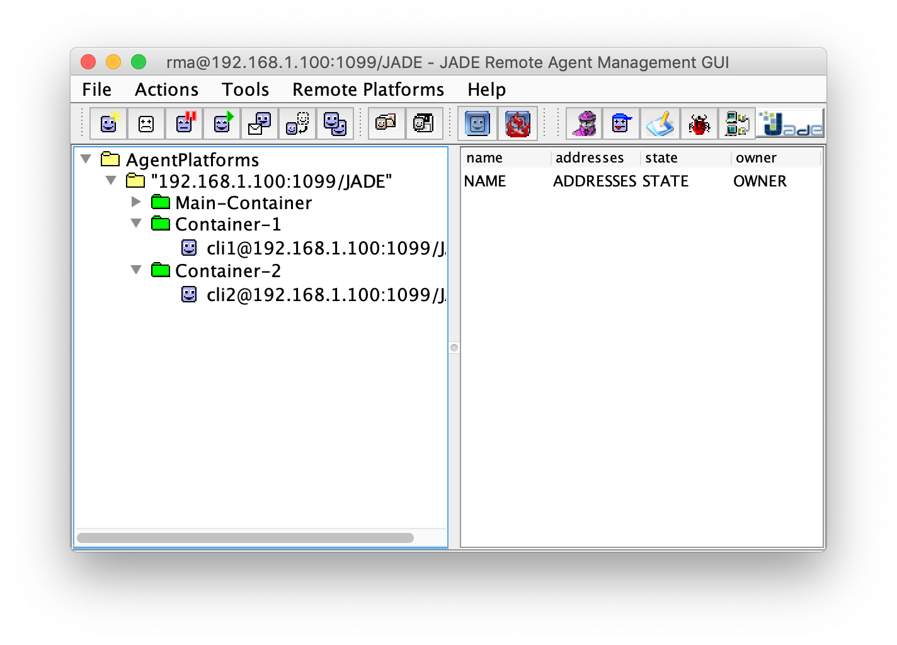
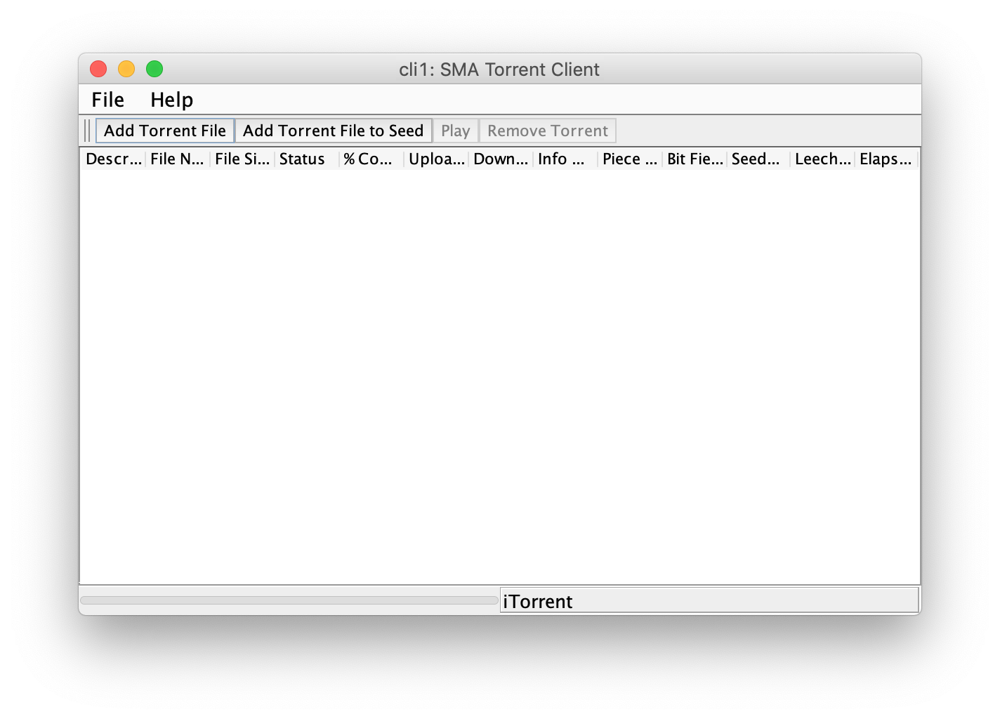

:numbered:

== SMA Torrent image:https://github.com/manoelcampos/sma-torrent/actions/workflows/maven.yml/badge.svg[link=https://github.com/manoelcampos/sma-torrent/actions/workflows/maven.yml]

A Java 8 BitTorrent client using the http://jade.tilab.com[JADE Multi-Agent Systems (MAS) Framework].
It uses the infrastructure provided by the JADE framework as a tracker system that informs the clients the location of files they want to download using the BitTorrent protocol.

Each client is a Java Swing Application that uses the resources provided by the JADE framework to share files between running clients. The JADE server provides all the features to find and exchange pieces of file among the clients.
The BitTorrent protocol was implemented following the https://wiki.theory.org/BitTorrentSpecification[specifications here].

For more information, refer to link:paper-sma-torrent.pdf[this paper] (only in Portuguese).

Check some sample torrents inside the link:src/main/java[src/main/java] dir.

.JADE Server

.SMA Torrent GUI

== Disclaimer

The project can be useful just as a concept proof of Multi-Agent Systems (MAS), once the architecture of MAS using the JADE framework imposes a centralized server to allow the communication between the clients (agents/peers). 

Several BitTorrent systems have evolved to a decentralized management architecture that provides more independency, security, scalability and fault-tolerance. This way, the current project doesn't intend to be a viable BitTorrent client, but only a case study of MAS and JADE framework use.

THE SOFTWARE IS PROVIDED "AS IS", WITHOUT WARRANTY OF ANY KIND. For more information, see the link:LICENSE[license file].

== How to compile and run the project

The application cannot be run directly from the IDE or directly from its jar file.
If you try to run it, you will receive a message informing how to run the application.

The following steps show how to compile the project, start the JADE server and create several clients/agents in the same machine in order to test the BitTorrent client without needing several computers and network configurations.

Execute the following commands in a terminal of a Unix-based operating system, such as Linux or Mac OS X.

. Open a terminal in the project's root folder
. Compile the project: `mvn package` to generate the project jar file.
. Start the JADE server: `./0-start-server.sh` and wait until the JADE GUI is shown.
. You can use the command `./1-create-clients.sh number-of-clients-to-create` to create several clients/agents at the folder `clients`. For instance, executing `./1-create-clients.sh 2` will create two clients named `cli1` and `cli2` at the `clients` folder. As the JADE framework requires that each client/agent has a alias, the scripts consider that when creating and executing a client.
. To run each created client/agent you have to execute the command `./2-exec-client.sh agent-alias` for each client/agent you want to run. For instance, executing `./2-exec-client.sh cli1` will run the agent named `cli1` that has to be created previously at the folder `clients/cli1`.

To start seeding a file, you have to place the file and its respective torrent in the same directory and add it to a client/agent GUI.